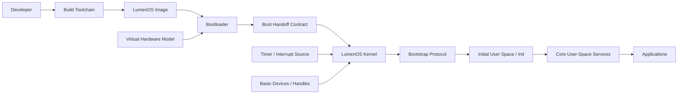

# 3. Context and Scope

## 3.1 System Context

LumenOS consists of a minimal kernel core and a growing user-space ecosystem built on top of explicit kernel abstractions. The boot path is mediated by an explicit contract rather than a vague transfer of control.

## 3.2 Scope of This Initial Baseline

### In scope now

- kernel boundary definition
- minimal kernel object model
- first execution fastpath
- formal boot handoff contract
- formal bootstrap protocol
- minimal boot path from bootloader to init
- early userspace transition
- initial deployment target for bring-up

### Not in scope yet

- full driver ecosystem
- SMP scaling strategy
- filesystem design
- advanced virtual memory features
- multi-architecture support
- formal verification strategy
- rich security policy framework
- production-grade observability stack
- complex multi-stage service orchestration during boot

---
