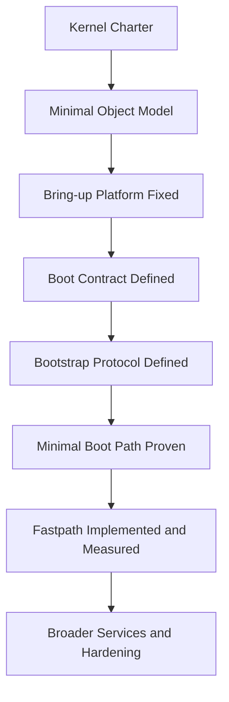

# 4. Solution Strategy

## 4.1 Strategic Approach

The architecture follows one simple rule:

**first prove the backbone, then scale the organism.**

That means:

- lock the bring-up platform early
- define kernel objects before broad feature work
- define the boot handoff before broad subsystem growth
- define the bootstrap protocol before richer user-space services emerge
- build the first fastpath as the architectural truth serum
- use the Kernel Charter to stop boundary creep
- postpone optional sophistication until the base path is real

## 4.2 Strategy in Pictures

## 4.3 Core Design Principles

- Small kernel, explicit contracts
- Objects instead of hidden special cases
- Capabilities instead of ambient authority
- IPC as a central mechanism, not an afterthought
- Performance work only on validated paths
- Add power by composition, not by kernel sprawl
- Treat boot and bootstrap as architecture, not as glue code

---
