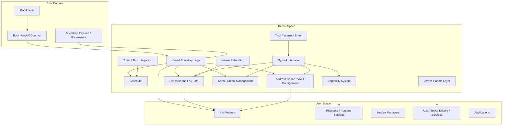
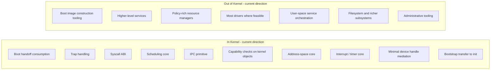

# 5. Building Block View

## 5.1 Whitebox Overview

## 5.2 Initial Kernel Object Model

The current minimal kernel object set is:

- **Task / Process** — execution container and ownership boundary
- **Thread** — schedulable execution unit
- **AddressSpace** — virtual memory context
- **VMO** — virtual memory object / memory-backed mapping primitive
- **Capability** — explicit right to reference and operate on kernel objects
- **Channel / Endpoint** — IPC primitive
- **Interrupt** — interrupt representation / binding target
- **Timer** — timer object for scheduling and timed events
- **DeviceHandle** — controlled access path to device-facing functionality

## 5.3 Object Lifecycle Concerns

Each object type must define these aspects explicitly:

- creation
- ownership
- delegation
- revocation
- destruction / lifecycle end

This is not documentation garnish. It is part of the architecture itself.

## 5.4 Boot-Related Responsibilities

The minimal boot path sharpens the responsibility split:

### Bootloader responsibilities

- load the kernel image
- prepare the initial execution environment
- provide the agreed bootstrap parameters / payload
- transfer control only through the defined contract

### Kernel bootstrap responsibilities

- consume and validate handoff state
- initialize only essential memory and core execution structures
- establish the first kernel objects needed for bootstrap
- create the first user-space task/thread/address-space combination
- transfer control to init according to bootstrap protocol

### Init responsibilities

- receive bootstrap state from the kernel-defined interface
- perform the first higher-level user-space initialization steps
- bring up the next layer of services outside the kernel

## 5.5 Inside vs Outside the Kernel

The final Kernel Charter is still to be written, but the current direction is already visible.

---
