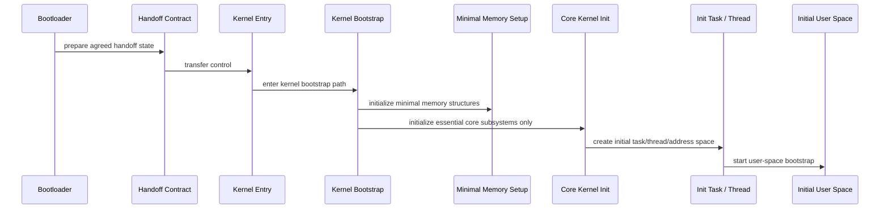
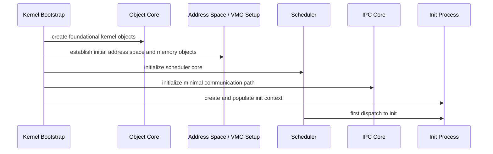
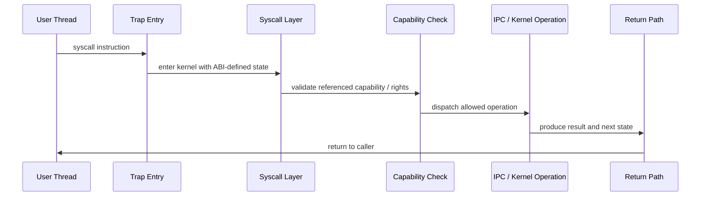

# 6. Runtime View

## 6.1 Minimal Boot Path

The minimal boot path is now a first-class architectural artifact.

## 6.2 Boot Protocol and Contract

The boot protocol defines the entry conditions under which the kernel may begin execution.

Architecturally, the contract exists to answer one brutal question clearly:

**what exactly may the kernel assume, and what must it still establish for itself?**

At the current level, the contract covers:

- who loads the kernel image
- who prepares the initial execution environment
- which bootstrap parameters or payload are handed over
- when ownership of execution passes to the kernel
- which assumptions are valid at kernel entry and which are not

## 6.3 Bootstrap Protocol Definition

Once inside the kernel, the second protocol begins. Its purpose is not to continue bootloader behavior but to define the controlled transfer from early kernel bootstrap to the first user-space process.

The bootstrap protocol is therefore responsible for:

- defining the kernel-side preconditions for init launch
- defining how init is identified and created
- defining what initial state or bootstrap data init receives
- ensuring that the transition to user space is minimal, deterministic, and inspectable

## 6.4 First Syscall / Fastpath Shape

## 6.5 Context Switch Focus

The context switch path is treated as one of the core architectural truth points. It must remain:

- minimal
- explicit in state ownership
- compatible with future isolation hardening
- measurable early

## 6.6 Synchronous IPC Focus

Synchronous IPC is part of the first fastpath, not a later add-on. This implies:

- IPC semantics influence the syscall ABI early
- capability handling must integrate with message endpoints from day one
- scheduling and IPC must be designed together, not sequentially

---
