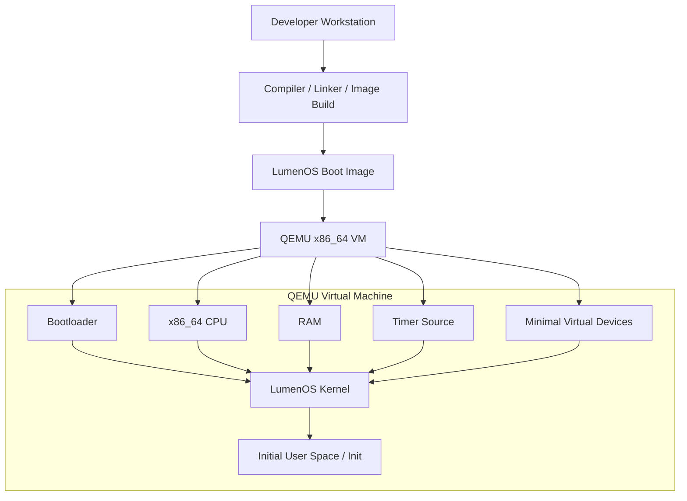

# 7. Deployment View

## 7.1 Initial Deployment Target

## 7.2 Deployment Decisions

- **x86_64 in QEMU first** — **Confirmed**
- The deployment path explicitly includes a **bootloader stage** — **Confirmed direction**
- Bare metal support is a later concern — **Confirmed direction**
- Additional architectures should only begin after the first userspace path is proven — **Working assumption**

## 7.3 Minimal Deployment Philosophy

The boot image must be sufficient to prove the end-to-end chain:

- bootloader starts
- kernel receives control through contract
- kernel reaches minimal internal readiness
- init starts
- further services remain optional for the first proof point

---
