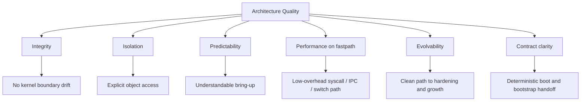

# 10. Quality Requirements

## 10.1 Architectural Quality Tree

## 10.2 Most Important Scenarios

### Scenario 1 — Clean bring-up
A developer boots LumenOS in QEMU, and the system reaches initial user-space execution through a controlled and observable handoff from bootloader to kernel to init.

### Scenario 2 — Valid kernel entry assumptions
The bootloader transfers control to the kernel, and the kernel consumes only the assumptions guaranteed by the boot contract instead of relying on accidental environment state.

### Scenario 3 — Deterministic bootstrap
The kernel creates the first runnable user-space context and launches init through the bootstrap protocol without leaking higher-level service responsibilities into the kernel.

### Scenario 4 — Valid syscall path
A user thread performs a syscall, the kernel validates the referenced authority, executes the operation, and returns without hidden side channels or undefined ownership transitions.

### Scenario 5 — Controlled IPC
Two user-space components communicate using the kernel IPC primitive, and authority is constrained by the capability model instead of global reachability.

---
